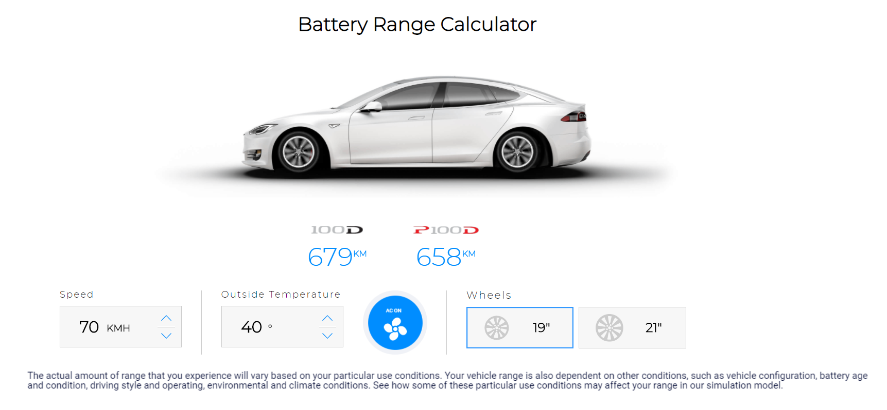

# Battery range calculator
The repository consists of the code for the 'take home test junior'. Following are the descriptions of the files:
- style.css : The css file containing the required format of the given elements
- components.js : The javascript containing the functions evoked upon clicking buttons and other elements, and corresponding changes to the results (and others if applicable)
- index.html : The HTML file contaning all the required elements. The components are nested. 

## Style choices
Some specific choices were made while designing, mainly for aspects which were not explicitly mentioned in the given test description. For instance, the value of key 'ac' required for the JSON file was set to 'off' at all configurations of the ac/heat button except when ac was on ( so 'ac' : "off" when AC is off, heat is on and heat is off). 

## Instructions to run
The webpage is to be hosted on a local server (the choice made to allow extraction of JSON values). The server can be created using the following command in the terminal (with a python > 3.x requirement):
```python -m http.server```.
The page should now be available at ```localhost:8000```




